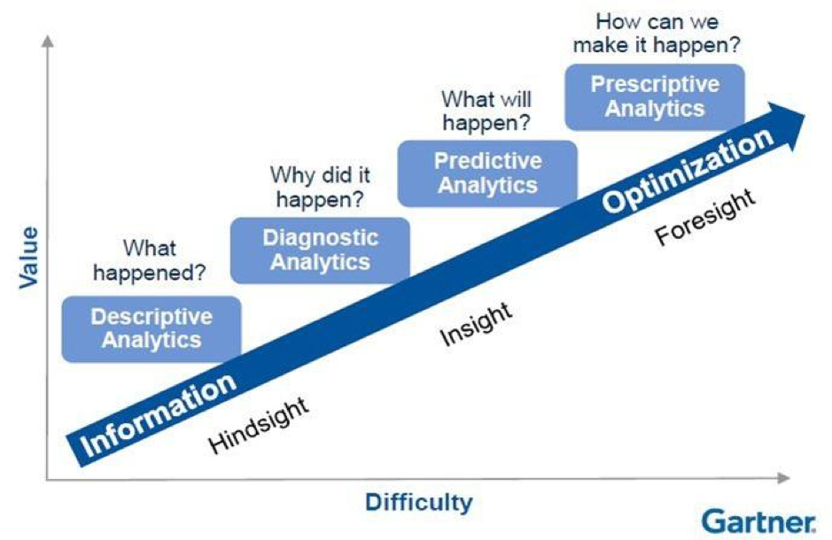
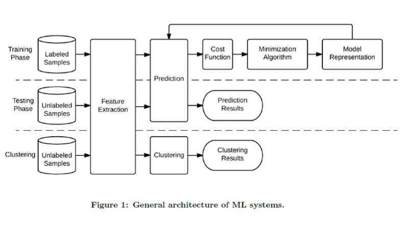
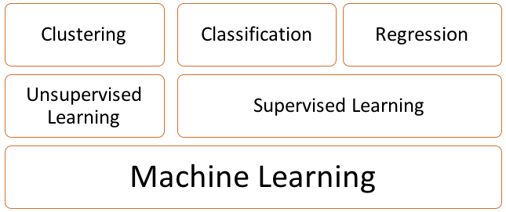
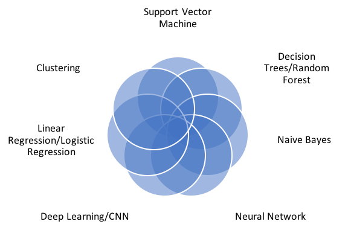
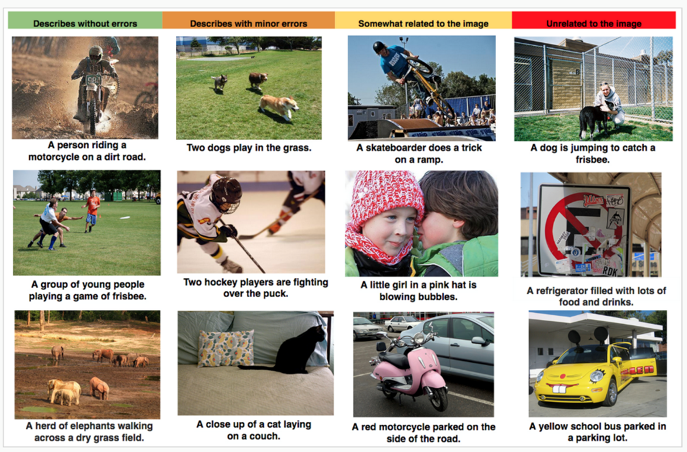
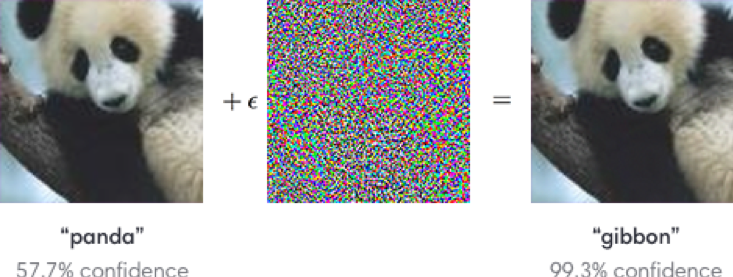
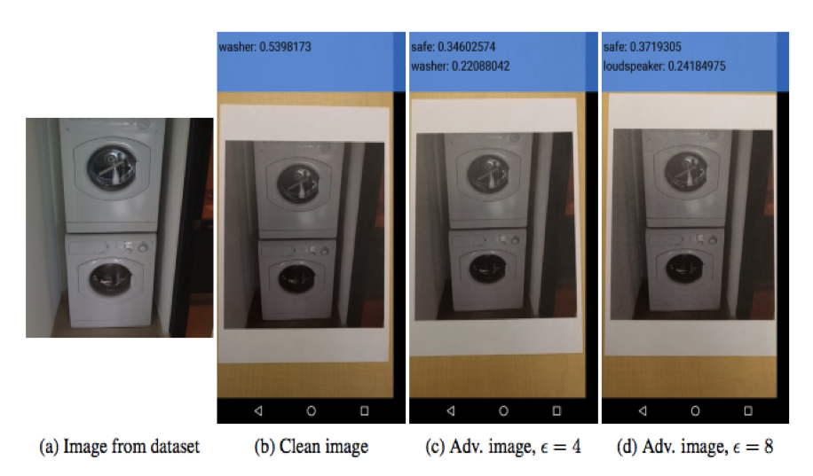
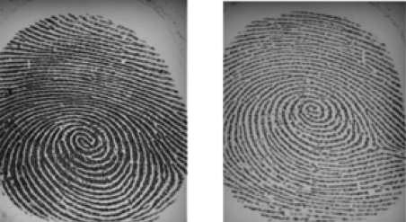
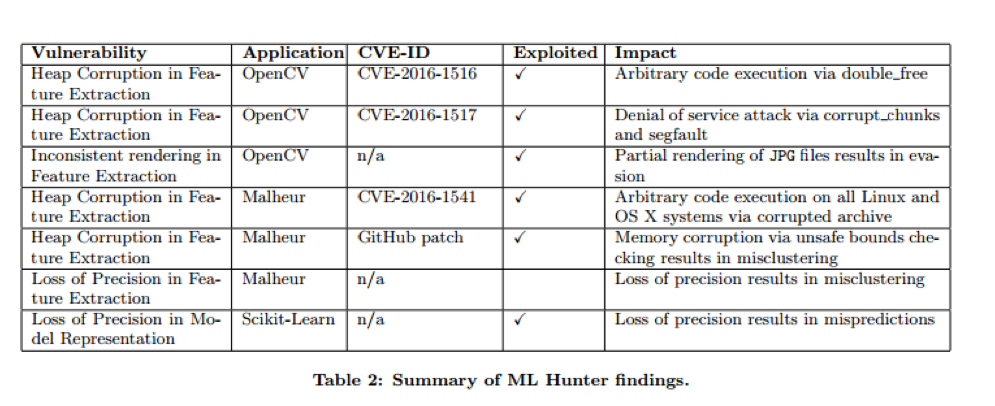

# Machine learning and security 
## Towards secure adoption of machine learning techniques

## Machine Learning Introduction

### AI definition

Artificial Intelligence combines theories and computer hardware and software implementations to mimic the human intelligence, these tasks are normally difficult for machines and easy for humans like: understanding images and videos, speech recognition, decision-making, robotics actions. 

### What is machine learning?

Machine learning is one of AI techniques which mimic the human learning process, so machines become able to learn from experience.

Think of it.. If you can build the best face detection application without touching any mathematical equation formula .. Just have a big dataset of human faces and the machine can learn from them. It is much more easy and natural.

Machine learning algorithms themselves use computational methods to “learn” information directly from data without relying on a predetermined equation as a model. The algorithms use also an optimization process to improve their performance if there are more data.

### Is it simply analytics?

### Why do we need Machine Learning?

Machine learning is used when there is:
- Difficulty to extract humans experience (medical image processing)
- Unavailability of Human expertise (exploring new relationships between data)
- When you need to deal with huge number options and factors (Media sites rely on machine learning to shift through millions of options to give you song or movie recommendations.)

### Building a machine learning
Building a ML system can involve different steps as show in figure []. It consists of:

- Getting data: data is generally represented as row of columns (matrices), each column represents a feature (pixel representing an image, housing price characteristic,  …). Before data can be used, it has to be cleaned up and normalized.

- Data is then divided into two separate set: training set (70%) and test set (30%). Training set is used to train machine learning algorithm, it is used to build a model that best fits the training set. The test set is used to evaluate how good a model is at predicting a new output.

- Training a model: at this stage, we need to choose a type of machine learning algorithm that fits our problems. In case there are several models to choose, a cross-validation set is used in order to select one that achieve the least error in the training set. A cross-validation data is taken from our data. The data can be then divided into 3 set: training (60%), cross-validation (20%) and test (20%).

- Evaluation: the final stage consists of evaluating the learned model against the test set (unseen examples).

- Machine learning algorithm can suffer from two common problems: (1) **high bias** (also known as *underfitting*) and (2) **high variance** (also known as *overfitting*). High bias correspond to a case where a trained model performs poorly over a training set, thus it will have a high error rate over a test data or unseen examples. While in the high variance case, the model overfits the training data but will fail to generalize over new data.

 (Stevens et al., 2017)

### Types of Machine Learning Algorithms

#### Supervised Machine Learning

It is a technique in which the system learns from a set of training data already containing a desired output value (also known as label). During the training, the learning algorithm constructs a model (a mathematical function) that fits a training data and can be generalized to predict output value on new unseen data.

#### Classification Techniques : Discrete output prediction
- The output can be binary: spam emails (genius/spam), tumor classification (cancer/benign)
- Or one of multiple categories: medical imaging, credit risk scoring.
Regression Techniques: Continuous output prediction (electricity load forecasting, algorithmic trading, housing price)

#### Unsupervised Machine Learning:

In contrast to a supervised machine learning, the unsupervised technique learns from unlabelled training data. Its objective is to learn the structure or relationship (pattern) in given data.
Clustering Technique: 
- The clustering algorithm tries to find group of things or people in the data such as different groups of visitors based on their visit behaviours, groups of customers based on their expenses
- The hierarchical cluster algorithm subdivides each group into smaller groups.

#### Association: 
- The goal is to find hidden patterns or rules in data (people who buy beer also buy chip)

#### Visualization:
- Unsupervised machine learning can learn from a complex data and output its 2D or 3D representation which can easily be plotted.

#### Dimensionality reduction:
- In machine learning, sometimes it is crucial to reduce the amount of data by removing unrelated features or merging correlated features. For example a number of persons living in a house correlates to the size of the house.

#### Anomaly detection:
- The system is trained with normal instance of data and then it is used to detect an unusual instance on new data. This is useful to detect a fraud or malicious activity.

## Machine Learning Algorithms

There are many ML algorithms and how to know which one is better than the other.
The answer can be hard. It depends on many factors for example complexity of problem/application, the amount of data availability, computing power and other constraints. In the figure below, it summarizes different some most widely used algorithms today. [This video](https://www.youtube.com/watch?v=IpGxLWOIZy4) explains briefly how each algorithm works.

## Machine Learning Application
ML applications involve using different ML techniques which can be a module or submodule or a complete independent system work as a pipeline in order to achieve a task. Each module takes an input and feeds its output to another module. Each module can use different ML technique based on the task that it is required to solve. Below are some examples of ML applications:

-   **Facial Recognition**

    ML is used to for facial recognition. It gives a degree of confidence of each face detection.

    

-   **Automatic Annotation**

    Based on different elements found in a picture, ML system can compose a short description to annotate it.

    

-   **Emotional Detection**

    This example captures different facial expressions found in an image.

    

-   **Machine Translation**

    In this example, before a machine translation (MT) technique can be applied, it might first involve optical character recognition (OCR) then word segmentation before the MT can be actually applied. Finally image has to be regenerated.

    

### Why it is happening now?

The ML techniques have been around for decades but they start to gain popularity dues to several factors:

**Computing power**

- CPUs were 2^20s of times too slow
- Parallel processing/algorithms
- GPUs + OpenCL/CUDA
- FPGAs, custom hardware

**Datasets**

- Massive data sets:  Google, FB, Baidu, …
- Standardized data sets

**Tools and libraries**
- Theano
- Torch
- Caffe
- DeepLearning4J
- Amazon Machine Learning
- Azure ML Studio
- Caffe
- Scikit-Learn
- TensorFlow

## Machine Learning Security

We see that the usage of ML flourishes in every domains and industries, nevertheless, ML has its own security problem. There are works that have been demonstrated to exploit or fool ML system.

### Types of attacks:(attackers knowledge)

- Whitebox: Attacker knows about model used + data + hyperparameters/meta data
- Gray Box: Partial knowledge about model or data
- Black box: No knowledge about model or data

### Types of Exploits

In searching for exploitable bugs, the adversary does not pursue the usual goals of vulnerability exploitation, e.g., gaining control over remote hosts, achieving privilege escalation, escaping sandboxes, etc. Instead, the adversary’s goal is to corrupt the outputs of machine learning programs using silent failures.

- Misprediction: in supervised learning let the algorithm generate different label than the desired one.
    - Training phase: Poisoning of the classifier, 
    - Testing phase: Evasion. 
- Misclustering: in unsupervised learning this may cause inputs to be placed in different clusters.
- Confidence reduction
- Denial of service, causing the application to crash 
- Code execution capabilities for the attacker. 
- Most of machine learning algorithms are open source as a result attacker can have access to them easily, to discover how to run exploits

### Adversarial machine learning

Adversarial machine learning is a research field which is an intersection of machine learning and computer security. The goal of adversarial machine learning is safe adoption of machine learning techniques in an adversarial setting [3]. 

Most of the machine learning techniques are vulnerable to the adverse environments. In the real world scenario this creates a lot of security vulnerabilities in the systems which widely use machine learning techniques like spam filtering, network intrusion detection, malware detection as well as computer vision and speech recognition.

Recent research suggests that all the real world systems are vulnerable to adversarial inputs and can cause misclassification. Misclassification in case of malware detection and intrusion detection completely defeats the purpose of the machine learning application.

There are 3 main goals behind studying adversarial machine learning
-   Developing attacks against machine learning models.

-   Systematic methodology for security evaluation of machine learning algorithms against various attacks

-   Developing defense mechanisms to mitigate these threats.

Adversarial examples are malicious inputs designed to fool machine learning models. [In this video](https://www.youtube.com/watch?v=oQr0gODUiZo) the author shows some works that have been performed in deep neural network (DNN) in order to find perturbation in the ML system by providing some crafted inputs so that the system will output a misclassification.

Some adversarial attacks examples are illustrated as below:

- An adversarial input, overlaid on a typical image, can cause a classifier to miscategorise a panda as a gibbon.

- Adversarial examples can be printed out on normal paper and photographed with a standard resolution smartphone and still cause a classifier to, in this case, label a "washer" as a "safe".
https://blog.openai.com/adversarial-example-research/

- Face Anti-Spoofing Tool is an example on how we can detect a spoofing biometric authentication.
(https://pralab.diee.unica.it/en/FaceAntiSpoofingTool) 

-  [ALFASVMLib](https://pralab.diee.unica.it/en/ALFASVMLib) is an open-source Matlab library that implements a set of heuristic attacks against Support Vector Machines (SVMs). The goal of such attacks is to maximally compromise the SVM's classification accuracy by mislabeling a given fraction of training samples. They are indeed referred to as **adversarial label flip attacks**, and can be also considered a form of worst-case label noise.

- [Fingerprint and face liveness detection](https://pralab.diee.unica.it/en/LivenessDetection) 
: It has been shown since from 2002 that fingerprint can be replicated using artificial materials

Fingerprint images coming from a live (left side) and a fake
finger (right side), almost indistinguishable.

A possible way to derive a fake finger from a person.

- [Python library to benchmark machine learning systems](https://github.com/tensorflow/cleverhans)

    This Python library is to benchmark machine learning systems' vulnerability to adversarial examples. More information can be found on [cleverhans website](http://www.cleverhans.io/). 

    http://www.cleverhans.io/security/privacy/ml/2017/02/15/why-attacking-machine-learning-is-easier-than-defending-it.html

    http://www.cleverhans.io/security/privacy/ml/2017/06/14/verification.html

-   [**Bayesian poisoning**](https://en.wikipedia.org/wiki/Bayesian_poisoning) is a technique used by e-mail spammers to attempt to degrade the effectiveness of spam filters that rely on Bayesian spam filtering. Bayesian filtering relies on Bayesian probability to determine whether an incoming mail is spam or is not spam. The spammer hopes that the addition of random (or even carefully selected) words that are unlikely to appear in a spam message will cause the spam filter to believe the message to be legitimate—a statistical type II error.

    Spammers also hope to cause the spam filter to have a higher false positive rate by turning previously innocent words into spammy words in the Bayesian database (statistical type I errors) because a user who trains their spam filter on a poisoned message will be indicating to the filter that the words added by the spammer are a good indication of spam.

### Model stealing

Models stealing refers to stealing of deployed machine learning models. Stealing here refers to stealing the various models specs like number of leaves in case of Decision trees, hyper parameters number of layers in NN, learning rate etc.

https://github.com/ftramer/Steal-ML

## Defense Techniques
Despite many adversarial attacks on ML, not many works have been done on defense techniques. There are some on going works but it is still an open challenge. Below are some defense techniques that have been shown:

### Data protection
    
apply what we already know in data protection and application protection techniques on machine learning systems

### Adversarial training
Adversarial training is the process of explicitly training a model on adversarial examples in order to make it more robust to attack or to reduce its test error on clean inputs.
injecting adversarial examples into the training set (also called adversarial training) could increase robustness of neural networks to adversarial examples.
-	Distillation as a Defense to Adversarial Perturbations against Deep Neural Networks https://www.youtube.com/watch?v=oQr0gODUiZo 

-   [Super-Sparse Biometric Recognition](https://pralab.diee.unica.it/en/SparseBiometricRecognition)

An example of virtual faces found by the approach for a given client. The first virtual face well resembles the genuine client, while the remaining three faces are combination of impostors. These latter images, as in cohort-based biometric verification, help improving the correct verification of the genuine client

- Publish CVEs [2]

## Reference
[1] Kurakin, A., Brain, G., Goodfellow, I. J., & Bengio, S. (n.d.). ADVERSARIAL MACHINE LEARNING AT SCALE. Retrieved from https://arxiv.org/pdf/1611.01236.pdf

[2] Stevens, R., Suciu, O., Ruef, A., Hong, S., Hicks, M., & Dumitraş, T. (2017). Summoning Demons: The Pursuit of Exploitable Bugs in Machine Learning, (Ml). Retrieved from http://arxiv.org/abs/1701.04739

[3] https://en.wikipedia.org/wiki/Adversarial_mac

[4] Biggio, Battista, and Fabio Roli. "Wild Patterns: Ten Years After the Rise of Adversarial Machine Learning." arXiv preprint arXiv:1712.03141 (2017).

